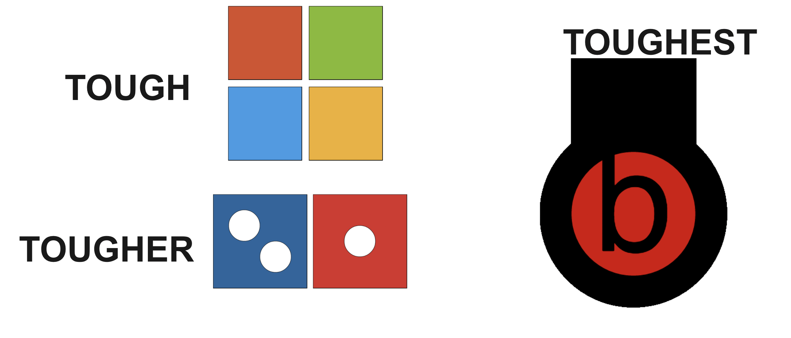
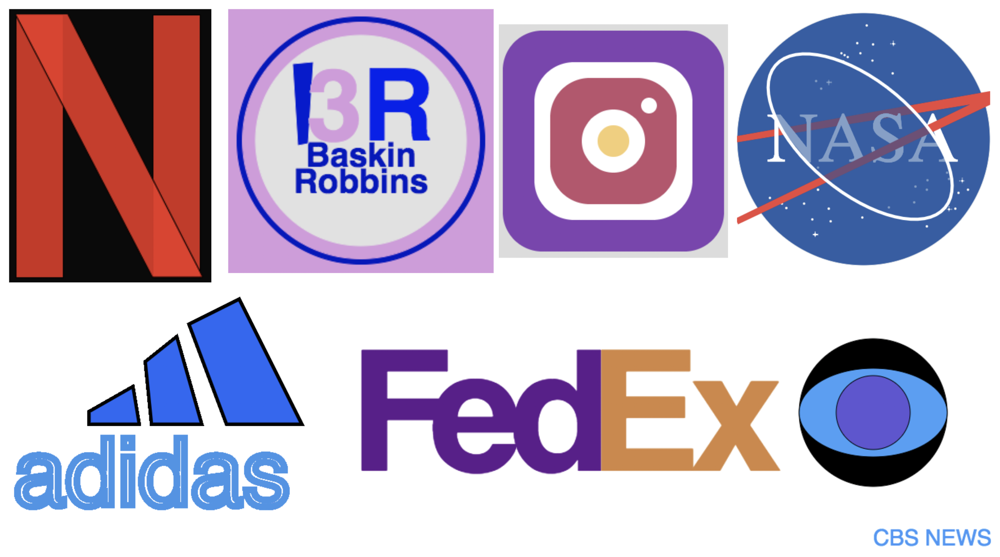

# Good and Bad

## Describe an instance when you were teaching somthing computer science related and it went poorly. Why do you think it didn't go well? What would you do (have you done) to make it better?

I teach the Github in my web design course. When I first taught it, it was the first topic before introducing HTML/CSS. It wasn't a complete train wreck, but it was pretty bad (considering how it compares to what I do now). The problem with Github being the pre-cursor to HTML/CSS was two-fold:

1. Without proper motivation, learning Github can feel purposeless. To say "trust me, it'll make sense WHY we need this... later" isn't quite enough for most kids.
2. Github (command line, git, github) is significantly more difficult than most HTML/CSS. So to start off the year with the most difficult concepts, and then "coast" the rest of the year is quite different than most curricular models of "ramping up."

To address these two issues, I simply swapped (or rather, interjected) the placement of Github. Now, my units are as follows:

1. Basic web design
2. Github
3. Advanced web design

Throughout Unit 1, students are able to experience problems to which Github is the solution, namely:

1. Version control with fluid revert capabilities
2. Collaboration that isn't real-time, but it's often better

Not only were students properly motivated by the end of Unit 1, but throughout Unit 2, we were able to perform version control and collaboration with more meaningful HTML/CSS files than relatively plain markdown files.

## Describe an instance when you were teaching somthing computer science related and it went really well. Why do you think it went so well?

My most memorable lesson was teaching colors with p5js. They had just learned shapes, and they were hungry to add color to bring their "drawings" to life. After a quick mini-lesson on digital color theory using the "Target" logo, I gave students a differentiated pair activitity of replicating a logo:

* TOUGH: Microsoft
* TOUGHer: Dominos
* TOUGHEst: Beats

I had students work in pair programming mode, with the navigator planning the shapes on a paper template grid, and the driver turning the sketch into code. All students have been engaged every time I have done this lesson, and they love continuing the challenge for homework as they get to replicate any logo of their choosing.

Ultimately, I think this lesson went so well because:

* It was visual
* There were clear roles, and both partners had a meaningful task, but had to work together
* Students had choice
  * In "difficulty" for their classwork
  * In "enjoyment" for their homework (if it was me, I would have tried to create the logo of my favorite sports team)